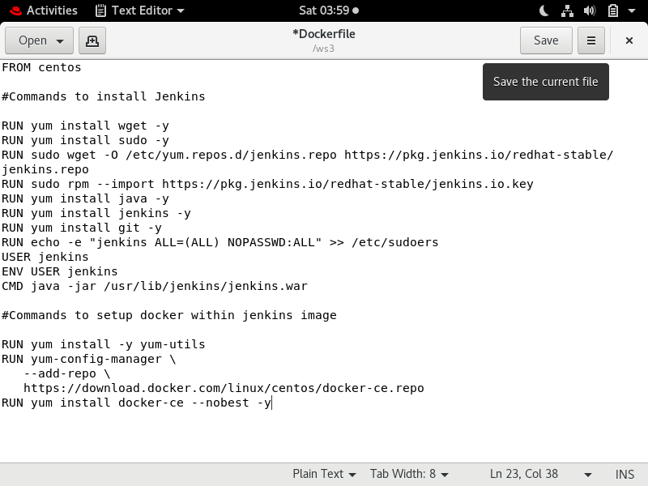

# Container-within-Container
   In this project, I have achieved containerization-within-container. Yes, you read it right, <b>Containerization-within-container</b>. Now you are wondering that isn't it        possible to do so ? So, Yes dear it is possible to do and here I will teach you the step-by-step procedure of how I build this interesting project. 
  
# Steps we will follow to accomplish this task are as follows-
1. First, we will create a Jenkins image on our own using Dockerfile.
2. When we launch this image, it should automatically starts Jenkins service in the container.
3. Create a job chain of job1, job2 and job3 using a build pipeline plugin in jenkins.  
4. <b>Job1</b> : Pull  the Github repo automatically when some developers push repo to Github.
5. <b>Job2</b> : By looking at the code or program file, Jenkins should automatically start the respective language interpreter install image container to deploy code, ( eg. If        code is of  HTML, then Jenkins should start the container that has HTML already installed ).
6. <b>Job3</b> : Test your app if it is working or not.
7. If not working, then send email to developer with error messages.

# How to create Jenkins Image using DockerFile?
*  Create a folder/dir with any name you want say '/ws' on your system. 
*  Create a file must be named as 'Dockerfile' in that folder/dir.
*  Open the Dockerfile file and write the following commands in it:-

   
 
   After writing the command, for building the image using dockerfile you need to write the following command-
  
   <code><b>docker build -t jenkins-docker-os:v1.0 /ws (dir path)</b></code>
  
   This will create your own customize jenkins image having docker configured in it or you can pull my jenkins image from <a href="https://hub.docker.com/r/deepika1999/jenkins-    docker-os">My Docker Hub Account</a>.
  
# How to launch the image?
   After pulling or building the image, for using it we need to launch the image. For launching the os, write the following command-
  
   <code><b>docker run -dit -p 1234:8080 -v /:/host -v /var/run/docker.sock:/var/run/docker.sock --name c-in-c deepika1999/jenkins-docker-os:v1.0</b></code>
  
   This will launch your os and you can check it by typing  <code><b>docker ps</b></code>
  
   Go to your browser and type-
   
   <code><b>YourIP:1234</b></code> 

   This will take you to the page of jenkins unlock, unlock your jenkins and then login to the Jenkins.  
  
   After login, create 3 jobs using build pipeline plugin in Jenkins.
  
* <b>JOB1- GITHUB PULL:-</b>
   When some Dev commits the code, through triggers it will automatically push to Github and trigger the Job1 in Jenkins which will go to Github repo and downloads all the          code from there and copy the data to some folder. For copying, we are making some folder so write the below cmd in the execute shell of your jenkins Job 1.
   <code>sudo mkdir /c-in-c</code>
   <code>sudo cp -rvf * /c-in-c</code>

* <b>JOB2- LAUNCH CONTAINER:-</b>
   In the execute shell of Job 2, Write the following script-
    <code>if sudo cat /c-in-c/Website/index.html | grep html</code>
 <code>then</code> 
     <code>if sudo docker ps | grep html-server</code>
     <code>then</code> 
         <code>sudo docker stop html-server</code>
         <code>sudo docker rm -f html-server</code>
         <code>sudo docker run --privileged -d -it -p 4321:80 -v /c-in-c:/var/www/html --name html-server vimal13/apache-webserver-php:v1</code> 
     <code>else</code>
         <code>sudo docker run --privileged -d -it -p 4321:80 -v /c-in-c:/var/www/html --name html-server vimal13/apache-webserver-php:v1</code> 
     <code>fi</code>
 <code>else</code>
     <code>echo "Code out of the context"</code>
 <code>fi</code>

* <b>JOB3- TESTING:-</b>
   In the execute shell of Job 3, write the following script-
    <code>export status=$(curl -o /dev/null -s -w "%{http_code}" YOUR_IP:4321/Website/)</code>
 <code>if [ status==200 ]</code>
 <code>then</code> 
    <code>exit 0</code>
 <code>else</code>
    <code>exit 1</code>
 <code>fi</code>
 
 
# Build Pipeline View 

 

# Final Output
 
  After running all the jobs with success, type in your browser as-    <code>YOUR_IP:4321/Website/index.html</code>
   and you will see the output as below picture.
  
 
 
 I hope you understood this project and like the little effort of mine in explaining you about this concept of <b>Containerization-within-Container.</b> If you still left with any queries or facing any issues while building the same then feel free to ping me on my <a href= "https://www.linkedin.com/in/deepika-jangid-01b5391a9/">"LinkedIn Profile."</a> 

  Also if you want that within one click your all of the work to be done or something like pre-created version of this project so here I have something for you. Go to <a href= "https://hub.docker.com/r/deepika1999">My DockerHub Account</a> and pull this image <a href= "https://hub.docker.com/r/deepika1999/docker-in-docker">Docker-in-Docker.</a> Here everything is pre-created, you just need to follow the <b>README</b> file of this <a href= "https://hub.docker.com/r/deepika1999/docker-in-docker">"image"</a> to access it.

  
